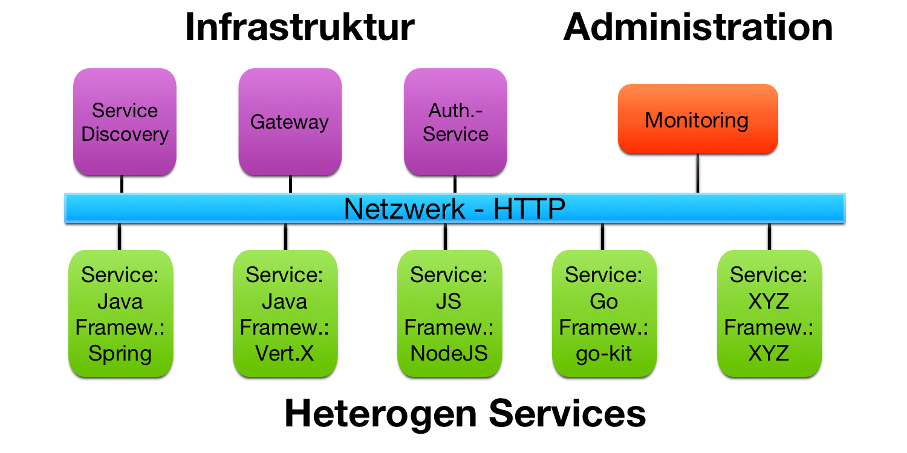
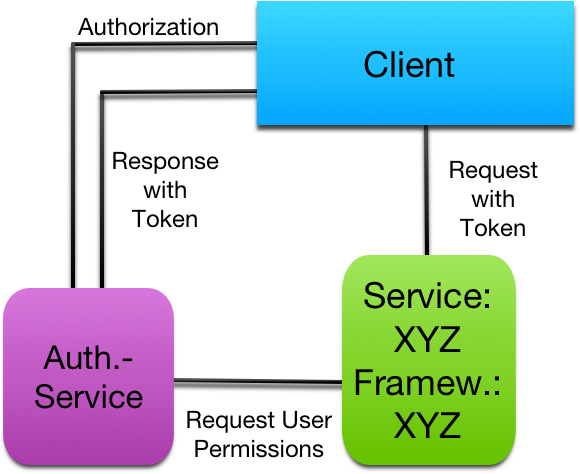

Bei der Microservice Architektur wird komplexe Anwendungssoftware mit kleinen,
unabhängigen Services komponiert, welche über eine sprachunabhängige
Programmierschnittstelle (z.B. Http/RESTful) kommunizieren. Diese Services sind
weitgehend entkoppelt und erledigen eine kleine Teilaufgabe. Dadurch wird
ein modularer Aufbau ermöglicht und setzt innerhalb der Services den Fokus
auf die kleine leichter zu lösende Teilaufgabe. So kann sich das
Entwicklerteam eines Services bei der Wahl der Programmiersprache und dem
Framework an den eigenen Fähigkeiten und der zu lösenden Teilaufgabe konzentrieren.
Durch diese freie Entwicklung kann der Service komplett unabhängig von den anderen
Services in die Produktion eingebracht werden.
Doch ist die Technologie-Entscheidung wirklich komplett unabhängig? Und passen
bestimmte Frameworks besser auf eine gegebene Aufgabe als andere, obwohl sie
die gleichen Funktionen bieten?

Im Rahmen dieser Bachelor Arbeit sollen eine Auswahl an aktuellen Frameworks mit
den zugehörigen Sprachen auf allgemeine und praxisrelevante Anforderungen
innerhalb einer Microservice Architektur untersucht und
bewertet werden. Dabei können die Anforderungen nur den einzelnen Service betreffen
als auch das Zusammenspiel der gesamten Architektur.

Ein wichtiger Bestandteil der Microservice Architektur ist dabei das Service
Registry Pattern. Durch die dynamische Skalierung eines Services kann ein Client
nicht direkt wissen, wo eine Instanz erreichbar ist. So ist es essentiell, dass
sich der Service an der Registry an- und abmeldet sowie einen Heartbeat sendet.

 \ 

Des Weiteren sollten die verwendeten Frameworks auch Schnittstellen
für Monitoring und Metriken mitbringen. Gerade bei vielen Services kann es
schnell unübersichtlich werden und ein manuelles Monitoring jedes einzelnen Services
wird schier unmöglich. So müssen zentral und automatisch in einem Monitoring-Service
alle Status-Informationen aller Services gesammelt werden können, um z.B. Fehler zu
erkennen oder dynamische Anpassungen durchzuführen.

Neben den Anforderungen an die Integration eines Services müssen auch Kriterien
der Sicherheit erfüllt werden. Gerade Services mit Anbindung an eine Datenbank
besitzen meist zu schützende Inhalte. So muss eine Authentifizierung und
Autorisierung am Service eingerichtet werden können, um den Service vor
Missbrauch zu schützen. Damit sich nicht jeder Service eigenständig um eine
Nutzer- und Rechteverwaltung kümmern muss, hat sich eine zentrale Lösung bewährt.
Der RFC Standard OAuth2 bietet hierfür die beste Grundlage. Die API eines Services
darf somit nur von Clients mit gültigem Token verwendet werden können. Und
entsprechende Rechte, die z.B. an der Rechteverwaltung abgefragt werden, sollten
den Zugriff limitieren.

\ 

Sollte mehrere Sprachen und Frameworks diese Anforderungen erfüllen, kann trotzdem
ein Kandidat geeigneter für die Umsetzung sein als ein Anderer. So kann der Overhead
eines Frameworks massiv die Performance des Services beeinträchtigen. Dies kann
sich in den benötigten Reaktionszeiten oder dem Ressourcen-Verbrauch zeigen.
Aber auch die Wartbarkeit spielt ein wesentliche Rolle. Eine Sprache in Kombination
mit einem bestimmten Framework kann für die Umsetzung einer Aufgabe, z.B. aufgrund
fehlender oder schwer zu konfigurierender Funktionen, schnell mehr als doppelt so viele
Programmartefakte hervorbringen als eine andere. In Zeiten von schnellen Release
Zyklen und Flexibilität spielt dies immer mehr eine Rolle.

Da nicht jeder Microservice die gleichen Aufgabentypen umsetzt, werden verschiedene
Anforderungsprofile für Services eingeführt. Diese beschreiben verschiedene Belastungen
und Nutzungen eines Services. So können den Anforderungen Gewichte zugeordnet werden,
um somit eine Empfehlung für den Einsatz der Sprachen und
Frameworks für diverse Aufgabentypen aussprechen zu können.

Im praktischen Teil der Bachelor Arbeit werden verschiedene Frameworks und die
dazugehörigen Sprachen als einfacher Microservice umgesetzt. Diese Services erhalten
eine Anbindung an eine MySQL Datenbank und bieten das gleiche Datenmodell als API
nach außen an. Zusätzlich bietet jeder Service eine einfache und eine rechenintensive
Geschäftsanwendung über die API an. Diese API wird mit einer Authentifizierung
abgesichert. Die damit entstandenen Microservices werden anschließend auf die oben
genannten Anforderungen untersucht. So werden allgemeine Umsetzungsprobleme festgehalten
und bewertet sowie am fertigen Service ein Stresstest durchgeführt. Anschließend werden
Sie in eine bestehende Microservice-Infrastruktur eingebunden. Mit den dabei gewonnen
Erkenntnissen werden für die Frameworks Empfehlungen für den Einsatz ausgesprochen.
Zudem werden nicht unterstütze und somit selbst entwickelte Funktionen als Library
für den zukünftigen Gebrauch festgehalten.
